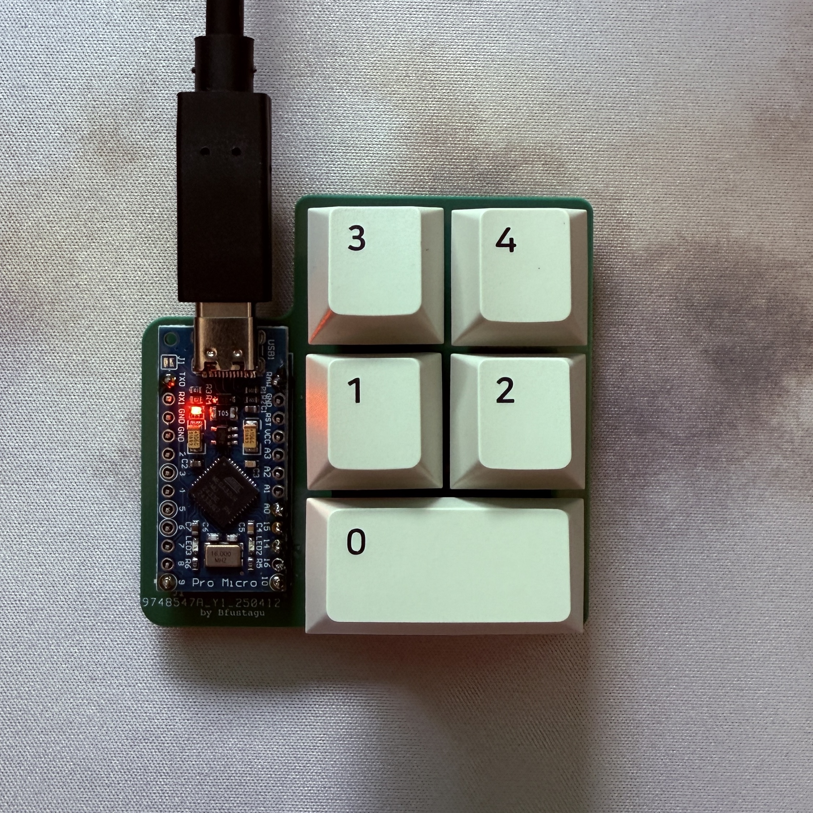
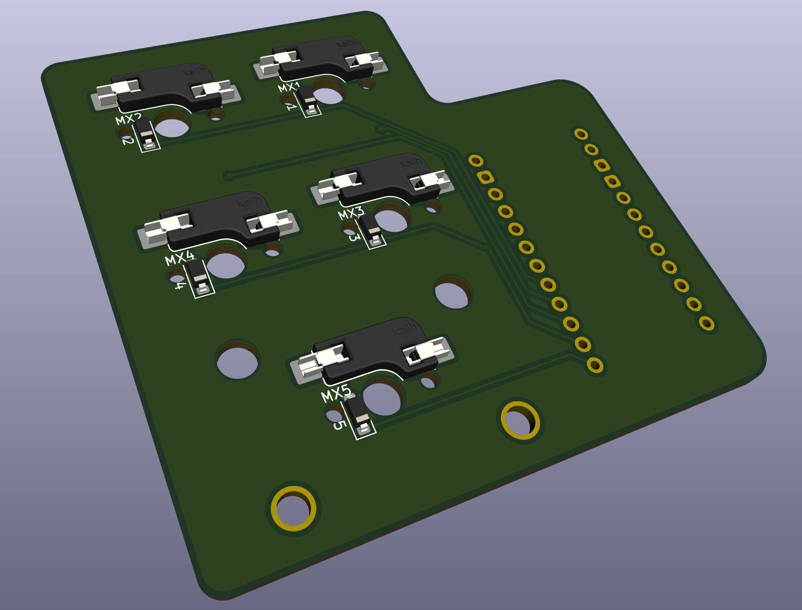
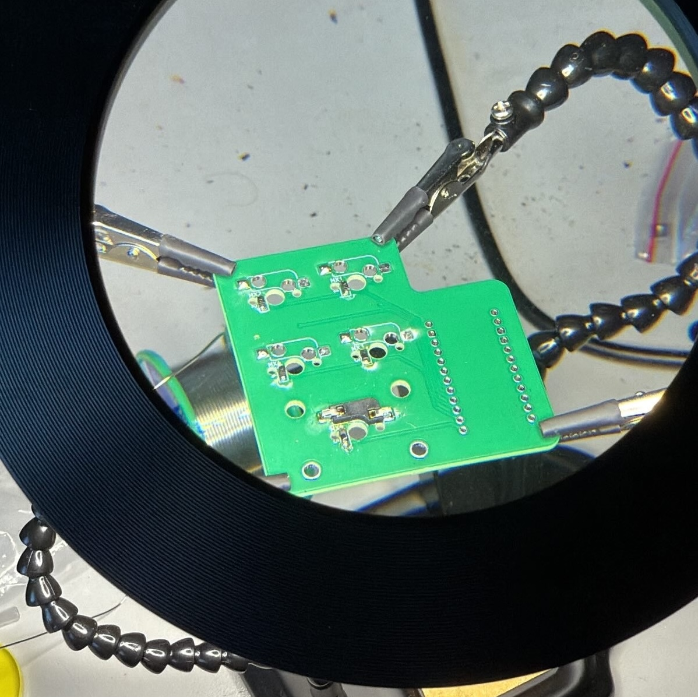

# 5-Key Keyboard Pad (Pro Micro-Based)

This project is a custom-built 5-key keyboard pad designed and developed entirely from scratch. It’s powered by a **Pro Micro microcontroller** and is fully compatible with **VIA Software**, a powerful configuration tool for custom keyboards.

## Features

- 5 fully customizable keys using VIA Software.
- Hotswap PCB, allowing for quick swap of Mechanical Switches.

## Project Journey

- **Custom PCB Design**  
  I designed the PCB from the ground up using **KiCad**, an open-source electronics design automation suite. The design files were sent to a professional manufacturer for production.

- **Manual Assembly**  
  Once the PCBs arrived, I soldered all components including diodes, Pro Micro and hotswap sockets.

- **Firmware Development**  
  I created and flashed the keyboard's firmware using **QMK Firmware**, an open source software widely used in the mechanical keyboard community. The keyboard is **VIA-compatible**. [VIA](https://usevia.app) is a user-friendly software that enables real-time keyboard customization through a simple graphical interface, allowing for key remaps, creation of macros, configuration of layers and more, without any coding involved.

## Process photos

Kicad modelling:

Soldering:

Final product:

