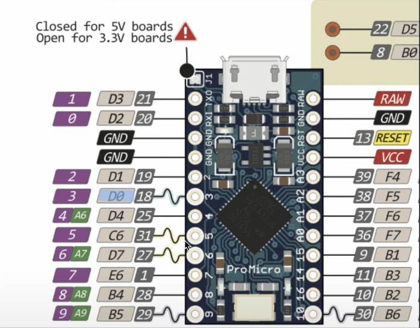
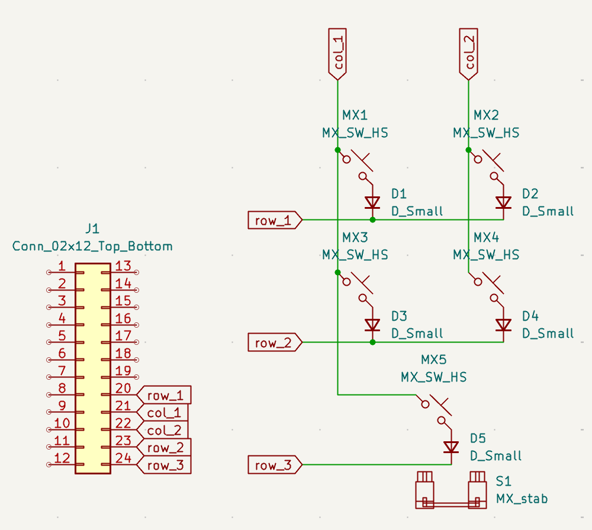
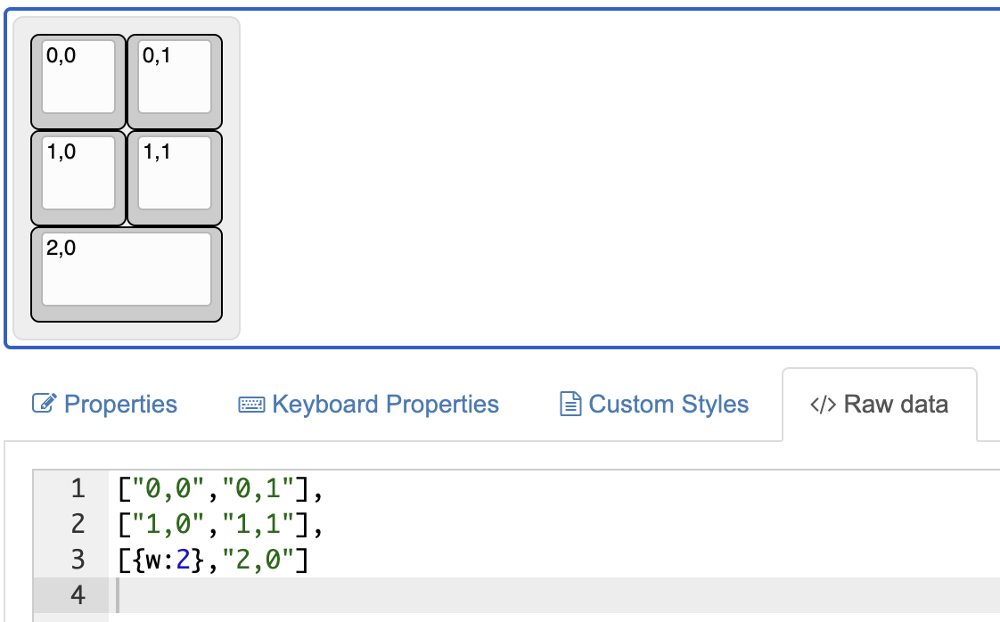

# 3x2_pad

## Create firmware

* Install QMK according to docs.
* Open folder `<local_path>/qmk_firmware` in VSCode.
* Run `qmk new-keyboard`.
    * Choose keyboard name: `3x2_pad` (no spaces and all lower case, this will actually be the keyboard folder name).
    * Choose layout: `None of the above`.
    * Choose MCU: Choose yours.
* Go to `/qmk_firmware/keyboards/3x2_pad/keyboard.json` and:
    * Modify `cols` and `rows` to map the MCU pins to the rows and cols of our schematic: 
        ```json
        "matrix_pins": {
            "cols": ["B1", "B3"],
            "rows": ["F7", "B2", "B6"]
        }
        ```
        <div style="display: flex; gap: 10px;">
            
            
        </div>
    * Modify `pid` (product id) and `vid` (vendor id) to yor likings with the help of a "ascii to hex online convertor".
    * Modify `layout` key:
        * `matrix` represents the key location in the schematic matrix, represented as `[<row>, <col>]`.
        * `x` and `y` are the coordinates in key units (1u, 1.25u, etc) of the top left position of a key, with the origin of coordinates situated at the top left.
        * In case a key is different than `1u`, we need to specify its width `w`.
    
        ```json
        "layout": [
            {"matrix": [0, 0], "x": 0, "y": 0},
            {"matrix": [0, 1], "x": 1, "y": 0},
            {"matrix": [1, 0], "x": 0, "y": 1},
            {"matrix": [1, 1], "x": 1, "y": 1},
            {"matrix": [2, 0], "x": 0, "y": 2, "w": 2}
        ]
        ```
* Create `/qmk_firmware/keyboards/3x2_pad/keymaps/default/rules.mk` with the content: `VIA_ENABLE = yes`.
* Modify `/qmk_firmware/keyboards/3x2_pad/keymaps/default/keymap.c` `LAYOUT` to the desired default layout:
    ```json
    LAYOUT(
        KC_P3,   KC_P4,
        KC_P1,   KC_P2,
        KC_P0
    )
    ```
* In `/qmk_firmware/keyboards/3x2_pad/`, create a `via.json` from scratch as you can see in this repo. The `keymap` key is derived from inputing in the Keyboard Layout Editor the `[<row>, <col>]` (explained before) and extracting the raw data.

    
* Flash the keyboard:
    * Option 1: Run `qmk flash -kb 3x2_pad -km default`. First it will compile a `3x2_pad_default.hex` file in `/qmk_firmware`. Then it will prompt you to enter bootloader mode by closing the circuit for RESET and GND. Once you do it, flashing will start and after that keyboard will be ready to use.

    * Option 2: Run `qmk compile -kb 3x2_pad -km default`. This will compile a `3x2_pad_default.hex` file in `/qmk_firmware`. Download `QMK Toolbox` and open it. Select the compiled `3x2_pad_default.hex`, enter bootloader mode by closing the circuit for RESET and GND, and finally click `flash`.
* To use it with Via, go to design tab and upload `/qmk_firmware/keyboards/3x2_pad/via.json`.